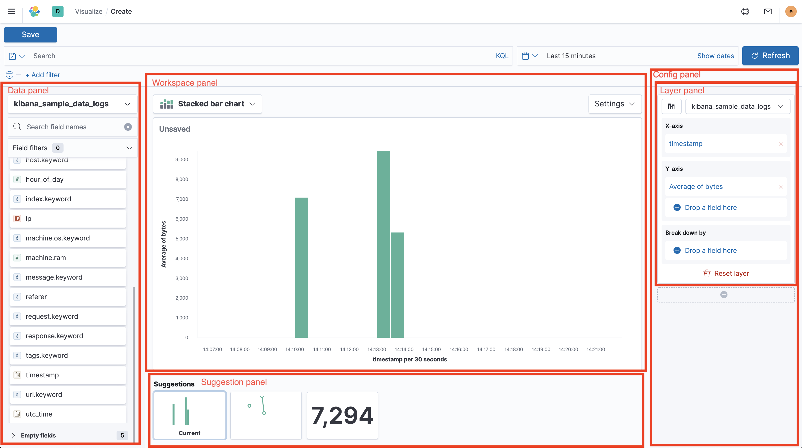

# Lens

Visualization editor allowing to quickly and easily configure compelling visualizations to use on dashboards and canvas workpads.

## Embedding

It's possible to embed Lens visualizations in other apps using `EmbeddableComponent` and `navigateToPrefilledEditor`
exposed via contract. For more information check out the example in `x-pack/examples/embedded_lens_example`.

## Testing

Run all tests from the `x-pack` root directory

- Unit tests: `yarn test:jest x-pack/plugins/lens`
- Functional tests:
  - Run `node scripts/functional_tests_server`
  - Run `node ../scripts/functional_test_runner.js --config ./test/functional/config.js --grep="lens app"`
  - You may want to comment out all imports except for Lens in the config file.
- API Functional tests:
  - Run `node scripts/functional_tests_server`
  - Run `node ../scripts/functional_test_runner.js --config ./test/api_integration/config.ts --grep=Lens`

## Developing tips

Lens state is kept in the Redux Store. To enable redux logger, open Chrome Developer Tools and type in the console: `window.ELASTIC_LENS_LOGGER=true`.

## UI Terminology

Lens has a lot of UI elements – to make it easier to refer to them in issues or bugs, this is a hopefully complete list:

* **Top nav** Navigation menu on top of the app (contains Save button)
  * **Query bar** Input to enter KQL or Lucene query below the top nav
  * **Filter bar** Row of filter pills below the query bar
  * **Time picker** Global time range configurator right to the query bar
* **Data panel** Panel to the left showing the field list
  * **Field list** List of fields separated by available and empty fields in the data panel
  * **Index pattern chooser** Select element switching between index patterns
  * **Field filter** Search and dropdown to filter down the field list
  * **Field information popover** Popover showing data distribution; opening when clicking a field in the field list
* **Config panel** Panel to the right showing configuration of the current chart, separated by layers
  * **Layer panel** One of multiple panels in the config panel, holding configuration for separate layers
    * **Dimension trigger** Chart dimension like "X axis", "Break down by" or "Slice by" in the config panel
    * **Dimension container** Container shown when clicking a dimension trigger and contains the dimension settints
    * **Layer settings popover** Popover shown when clicking the button in the top left of a layer panel
* **Workspace panel** Center panel containing the chart preview, title and toolbar
  * **Chart preview** Full-sized rendered chart in the center of the screen
  * **Toolbar** Bar on top of the chart preview, containing the chart switcher to the left with chart specific settings right to it
    * **Chart switch** Select to change the chart type in the top left above the chart preview
    * **Chart settings popover** Popover shown when clicking the "Settings" button above the chart preview
* **Suggestion panel** Panel to the bottom showing previews for suggestions on how to change the current chart

